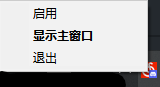

# 网易云音乐 NCM Discord Rich Presence (RPC)

## 介绍 About

支持同步歌曲，歌手，专辑，专辑封面和目前歌曲的播放时长和状态。歌曲的总时长暂不显示（见下方链接的讨论）。

Supports synchronizing song, artist, album, album cover and current song's playing time and status. Total duration of the song is not displayed for now.

For total duration, see https://github.com/aliencaocao/netease_cloudmusic_discord_rpc/discussions/16

纯Python写成，支持最新版网易云音乐，目前只支持Windows客户端。

Written in pure Python, supports latest versions of NetEase Cloud Music. Currently only supports the Windows client.

目前支持版本/Currently supported versions:

* 2.7.1 build 198277（微软商店版本）/ (Microsoft Store version)
* 2.10.5 build 200537（微软商店版本）/ (Microsoft Store version)
* 2.10.6 build 200601
* 2.10.7 build 200847
* 2.10.8 build 200945
* 2.10.10 build 201117
* 2.10.10 build 201297
* 2.10.11 build 201538
* 2.10.12 build 201849
* 3.0.0 WIP/正在开发中 (https://github.com/aliencaocao/netease_cloudmusic_discord_rpc/issues/26)

还会继续支持未来的新版本。/Support for future versions will be added.

旧版本（2.10.3及以下）可以使用这个项目 / For older versions (2.10.3 and below), you can check out this project：https://github.com/Kxnrl/NetEase-Cloud-Music-DiscordRPC

效果图 / Demo

## 使用方法 Usage
从Release页下载可执行文件(exe)，然后运行exe并保持运行。

使用X关闭程序窗口后，程序会以托盘图标的形式在后台继续运行。右键托盘图标可以控制程序。

程序必须以UAC模式运行（管理员权限）才能正常工作。请右键exe文件，点击属性，在兼容性页面里勾选“以管理员身份运行”。

与BetterDiscord等第三方Discord客户端不兼容。

Download the executable binary (exe) from the Release page, Keep the exe running.

If you close the program window with X, the program will continue to run in the background as a tray icon. Right-click the tray icon to control the program.

The program must be opened in UAC mode (Administrator permission) to work properly. Please right-click on the exe, click Properties, and check "Run as administrator" on the Compatibility page.

Not compatible with third-party Discord clients such as BetterDiscord.

# 构建 Building
你需要 / You need:
- Python 3.8 - 3.12
- `pip install -r requirements.txt`

运行build.txt里面的命令即可。

Run the commands in build.txt.

# Debugging mode
Make a file named `debug.log` in working directory, and the program will run in debugging mode and print logs to this file.

Inspired by https://github.com/Kxnrl/NetEase-Cloud-Music-DiscordRPC